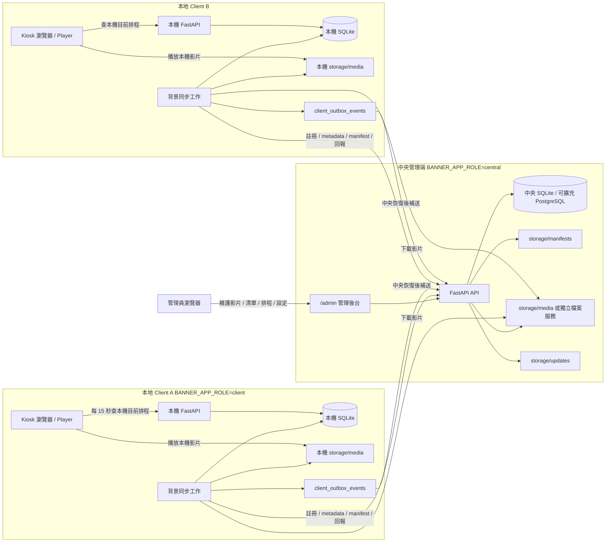
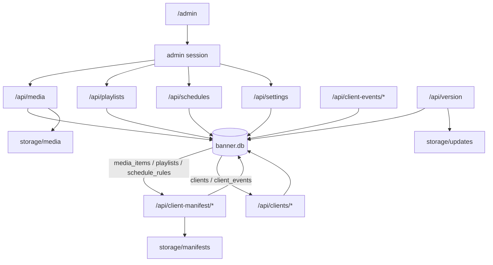
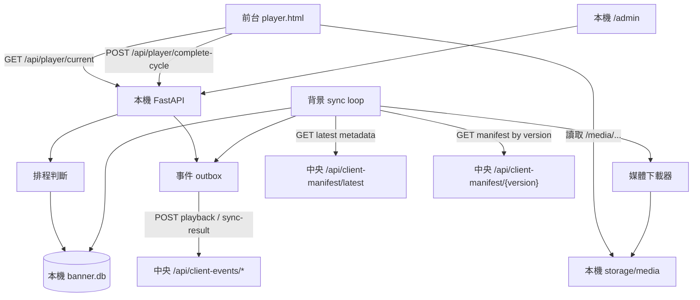
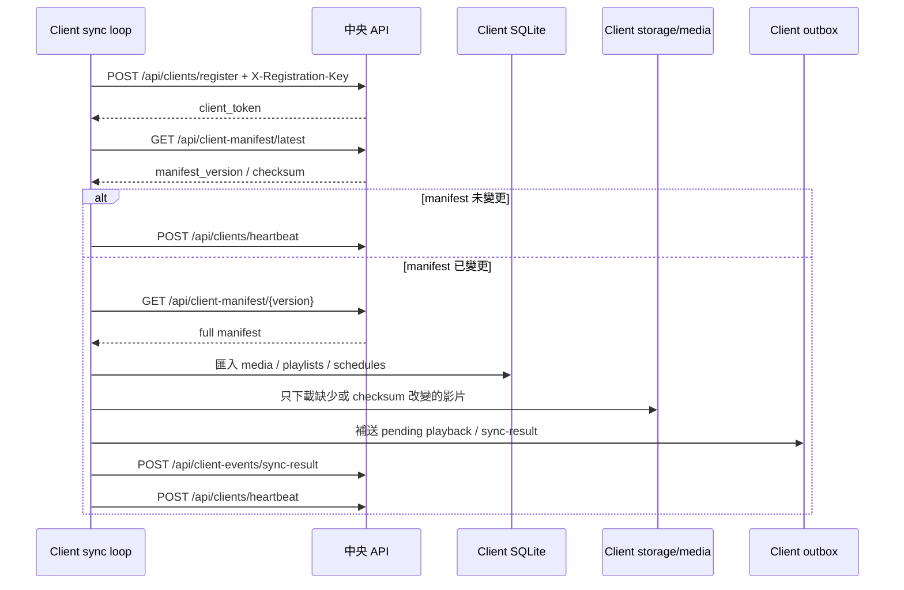
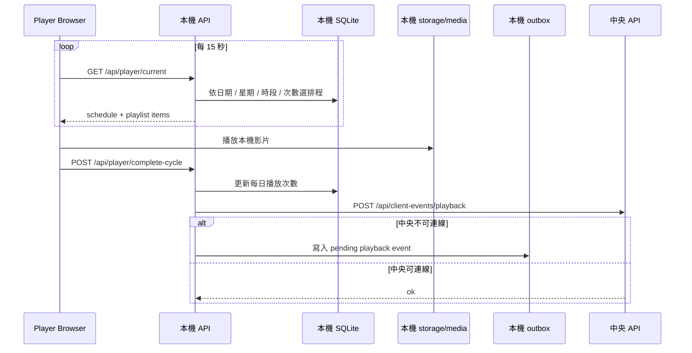
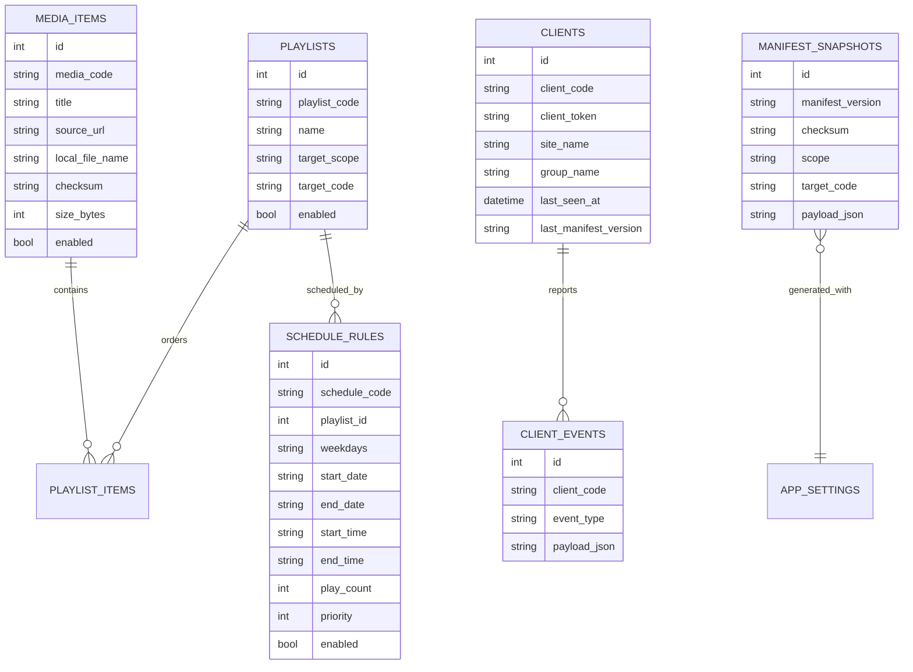

# 系統架構圖

本文件整理 RBS 在中央管理端與本地 client 模式下的整體架構。預設以免安裝 SQLite 運作；中央端擴大時可再改接 PostgreSQL。SQL Server 不列入優先支援。

## 圖片檔

- SVG：`docs/assets/system-architecture.svg`
- PNG：`docs/assets/system-architecture.png`

## 1. 整體拓樸

## 2. 中央端內部模組

## 3. Client 端內部模組

## 4. 同步流程

## 5. 播放流程

## 6. 資料表對應

## 7. 邊界與責任

- 中央端負責內容維護、manifest 版本、client 註冊、狀態與事件收集。
- client 負責本機播放、本機排程判斷、差異同步、媒體下載與離線補送。
- 前台播放器只連本機服務，不直接向中央查排程。
- 中央端不承擔大量即時影片播放流量；client 播放本機 `storage/media`。
- `client_registration_key` 用於首次註冊；註冊後使用 `client_token` 呼叫 manifest、heartbeat 與 event API。
